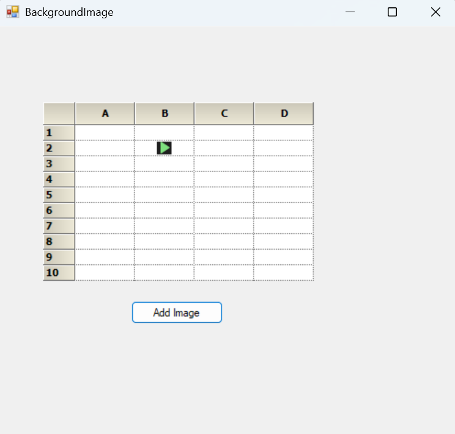

# How to center align the background image in a cell in WinForms GridControl?

In [WinForms GridControl](https://www.syncfusion.com/winforms-ui-controls/grid-control), a background image can be applied to a specific cell. To align the background image to the center, set the [BackgroundImageMode](https://help.syncfusion.com/cr/windowsforms/Syncfusion.Windows.Forms.Grid.GridStyleInfo.html#Syncfusion_Windows_Forms_Grid_GridStyleInfo_BackgroundImageMode) property to Center. This helps ensure the image is properly centered within the cell.

 ```csharp
 private void OnAddImage(object sender, EventArgs e)
 {
     var img = Image.FromFile(@"..\..\Images\img.png");
     this.gridControl1[2, 2].CellType = "Image";
     this.gridControl1[2, 2].BackgroundImage = img;
     this.gridControl1[2, 2].BackgroundImageMode = GridBackgroundImageMode.CenterImage;
 }
 ```



Take a moment to peruse the [WinForms GridControl - BackgroundImage](https://help.syncfusion.com/windowsforms/grid-control/appearance-and-formatting#setting-background-image) documentation, where you can find about background image with code examples.